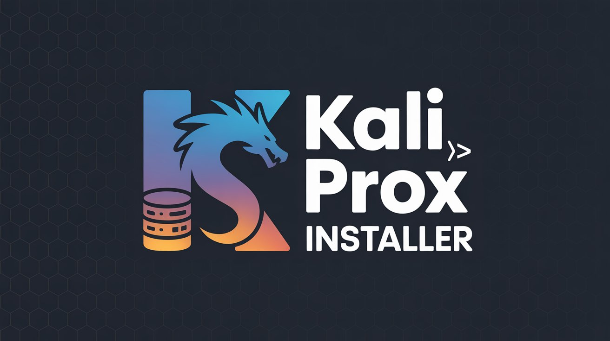

<div align="center">
  
</div>

<div align="center">

  [](https://www.gnu.org/software/bash/)
  [](https://www.ansible.com/)
  [](LICENSE)
  [](https://github.com/Sunwood-ai-labs/kali-proxmox-installer)


# Proxmox VE - Kali Linux 自動セットアップ

</div>


<div align="center">
  ISO + preseed + Ansibleで完全自動インストールを実現するツールキット
</div>

## 特徴

- 🔧 **ISO + preseed方式** - 一度ISOを作成すれば何度でもVMを作成可能
- 🚀 **完全自動インストール** - ユーザー、SSH、ネットワークを自動設定
- 📦 **Ansible対応** - 柔軟なパッケージ追加や設定変更
- 🔑 **SSH鍵認証** - パスワードなし接続の自動設定
- 🌐 **固定IP対応** - セットアップ後のネットワーク設定自動化
- 📤 **安全な配布** - preseedのパスワードは空で安全

## 🏗️ アーキテクチャ

```
┌─────────────────────────────────────────────────────────────┐
│ 1. ISO作成（一度だけ）                                          │
│    - Kali Linux ISOをダウンロード                              │
│    - preseed.cfgを組み込んで再構築                             │
│    - パスワードは空にして安全に                                 │
└─────────────────────────────────────────────────────────────┘
                              ↓
┌─────────────────────────────────────────────────────────────┐
│ 2. VM作成（何度でも）                                          │
│    - ISOから起動                                              │
│    - preseedで自動インストール                                  │
│    - ユーザー、SSH、ネットワーク、Ansibleを自動設定                    │
└─────────────────────────────────────────────────────────────┘
                              ↓
┌─────────────────────────────────────────────────────────────┐
│ 3. パッケージ追加・設定変更（何度でも）                              │
│    - ansible-playbook実行                                     │
│    - 柔軟なパッケージ追加や設定が可能                                │
└─────────────────────────────────────────────────────────────┘
```

## 📁 プロジェクト構成

```
prox/
├── scripts/
│   ├── setup/                      # セットアップスクリプト
│   │   ├── build-kali-iso.sh       # ISO作成スクリプト
│   │   ├── create-vm-from-iso.sh   # VM作成スクリプト
│   │   └── setup-proxmox-ssh.sh    # Proxmox SSH設定
│   └── ansible/                    # Ansible設定
│       ├── kali-playbook.yml       # Ansible Playbook
│       ├── ansible.cfg             # Ansible設定ファイル
│       ├── inventory/
│       │   └── kali.yml             # インベントリ
│       └── roles/
│           └── kali-setup/          # ロール
│               ├── defaults/        # デフォルト変数
│               ├── handlers/        # ハンドラー
│               └── tasks/           # タスク
├── examples/                       # Shell全部入り方式（参考例）
│   ├── setup/                      # 自動セットアップ
│   ├── ssh/                        # SSH設定
│   ├── network/                    # ネットワーク設定
│   └── manage/                     # VM管理
├── templates/
│   └── preseed.cfg                 # preseedテンプレート
├── assets/                         # 画像等のリソース
├── README.md
└── LICENSE
```

## 📋 前提条件

### Proxmoxホスト
- Proxmox VEがインストールされていること
- root権限またはsudo権限があること
- インターネット接続（ISOダウンロード用）
- 以下のパッケージ:
  - xorriso
  - wget

### クライアント（Ansible実行用）
- Python 3.8+
- Ansible 2.9+
- SSHクライアント

## 🚀 クイックスタート

### ステップ1: Proxmox SSH設定

ProxmoxホストへのSSH接続を設定します。

```bash
cd scripts/setup
./setup-proxmox-ssh.sh --host 192.168.0.147 --setup-keys
```

### ステップ2: ISO作成

preseed付きのKali Linux ISOを作成します。

```bash
sudo ./build-kali-iso.sh 2024.3
```

これで `kali-linux-2024.3-preseed.iso` が作成されます。

### ステップ3: VM作成

ISOからVMを作成して自動インストールを開始します。

```bash
./create-vm-from-iso.sh -i kali-linux-2024.3-preseed.iso --user maki
```

オプション:
- `-i, --iso <path>` - preseed付きISO（必須）
- `-n, --name <name>` - VM名（デフォルト: kali-linux）
- `-id, --vmid <id>` - VM ID（デフォルト: 自動）
- `-c, --cores <num>` - CPUコア数（デフォルト: 2）
- `-m, --memory <size>` - メモリMB（デフォルト: 4096）
- `-d, --disk <size>` - ディスクサイズ（デフォルト: 50G）
- `--user <username>` - ユーザー名（デフォルト: kali）
- `--password <password>` - ユーザーパスワード（デフォルト: 空）

### ステップ4: インストール完了を待つ

約10-15分でインストールが完了します。

インストール状況を確認:

```bash
# SSH経由でコンソールを開く
ssh proxmox 'qm terminal <VMID>'

# またはProxmox WebUI
# https://192.168.0.147:8006/
```

### ステップ5: Ansibleで設定追加

VMに追加のパッケージや設定を適用します。

```bash
cd ../ansible

# インベントリを編集してVMのIPアドレスを設定
vim inventory/kali.yml

# Playbook実行
ansible-playbook -i inventory/kali.yml kali-playbook.yml

# 特定のタスクのみ実行
ansible-playbook -i inventory/kali.yml kali-playbook.yml --tags packages
```

## 📖 詳細ドキュメント

### preseed.cfgテンプレート

`templates/preseed.cfg` は、Kali Linuxインストール時の自動応答ファイルです。

環境変数でカスタマイズ可能:

| 変数 | 説明 | デフォルト |
|------|------|-----------|
| `KALI_USER` | ユーザー名 | kali |
| `KALI_PASSWORD` | ユーザーパスワード | 空 |
| `KALI_ROOT_PASSWORD` | rootパスワード | 空 |
| `KALI_HOSTNAME` | ホスト名 | kali |
| `KALI_DOMAIN` | ドメイン | localdomain |

### Ansible Playbook

`scripts/ansible/kali-playbook.yml` は、インストール後の設定を管理します。

#### インベントリ設定

`inventory/kali.yml` でVMを定義:

```yaml
kali_vms:
  hosts:
    kali-01:
      ansible_host: 192.168.0.200
      ansible_user: kali
```

#### 追加パッケージ

インベントリまたはplaybookでパッケージを指定:

```yaml
all:
  vars:
    additional_packages:
      - nmap
      - wireshark
      - metasploit-framework
```

#### タグ

特定の設定のみ適用:

```bash
# パッケージのみ
ansible-playbook -i inventory/kali.yml kali-playbook.yml --tags packages

# SSH設定のみ
ansible-playbook -i inventory/kali.yml kali-playbook.yml --tags ssh

# ユーザー設定のみ
ansible-playbook -i inventory/kali.yml kali-playbook.yml --tags users
```

## 🔧 設定変数

### Proxmox設定

| 変数 | 説明 | デフォルト |
|------|------|-----------|
| `PROXMOX_HOST` | Proxmoxホスト | 192.168.0.147 |
| `PROXMOX_USER` | Proxmoxユーザー | root |
| `STORAGE` | ストレージ名 | local-lvm |

### VM設定

| 変数 | 説明 | デフォルト |
|------|------|-----------|
| `VM_NAME` | VM名 | kali-linux |
| `VM_ID` | VM ID | 自動 |
| `VM_CORES` | CPUコア数 | 2 |
| `VM_MEMORY` | メモリ(MB) | 4096 |
| `DISK_SIZE` | ディスクサイズ | 50G |

## 💡 使用例

### 基本的なVM作成

```bash
cd scripts/setup
./create-vm-from-iso.sh -i kali-linux-2024.3-preseed.iso
```

### カスタムユーザーでVM作成

```bash
./create-vm-from-iso.sh -i kali-linux-2024.3-preseed.iso --user maki --password securepass
```

### 大きなディスクでVM作成

```bash
./create-vm-from-iso.sh -i kali-linux-2024.3-preseed.iso -d 100G -m 8192
```

### Ansibleでセキュリティツールを追加

```bash
cd scripts/ansible
ansible-playbook -i inventory/kali.yml kali-playbook.yml \
  -e "additional_packages=[nmap,wireshark,metasploit-framework]"
```

## 🔐 セキュリティについて

- **preseedのパスワードは空** - セキュリティのため、デフォルトでは空になっています
- **環境変数で指定** - VM作成時に `--password` オプションで指定可能
- **SSH鍵認証** - Ansibleは鍵認証を使用
- **sudo設定** - ユーザーはパスワードなしでsudo可能

## 🐛 トラブルシューティング

### ISO作成が失敗する

```bash
# 依存パッケージを確認
sudo apt-get install xorriso wget

# ディスク容量を確認
df -h
```

### VMが起動しない

```bash
# VMステータスを確認
qm status <VMID>

# VMログを確認
qm config <VMID>
```

### Ansibleが接続できない

```bash
# SSH接続をテスト
ssh kali@<VM-IP>

# インベントリ設定を確認
cat inventory/kali.yml
```

## 🔄 参考: Shell全部入り方式

`examples/` に、1スクリプトで完結する方式の例を置いてあります。

```bash
cd examples/setup
./kali-autoinstall.sh
```

- ✅ 1コマンドで全部やってくれる
- ✅ Shellだけで動く
- ❌ 毎回ISOをダウンロード
- ❌ 設定変更はスクリプト修正が必要

**本番運用では `scripts/` のISO + Ansible方式を推奨します。**

| 特徴 | Shell全部入り（参考） | ISO + Ansible（推奨） |
|------|-------------------|-------------------|
| 自動化 | preseedのみ | preseed + Ansible |
| パッケージ追加 | スクリプト修正必要 | Playbookで柔軟に対応 |
| 設定変更 | スクリプト修正必要 | Playbookで管理 |
| 再利用性 | スクリプト実行毎回 | ISOを再利用可能 |

## 🔗 参考リンク

- [Kali Linux Downloads](https://www.kali.org/get-kali/)
- [Kali Linux Preseed](https://www.kali.org/docs/development/live-build-a-patch-directory/)
- [Proxmox VE Documentation](https://pve.proxmox.com/wiki/Main_Page)
- [Ansible Documentation](https://docs.ansible.com/)

## 📄 ライセンス

MIT License - [LICENSE](LICENSE) を参照してください
